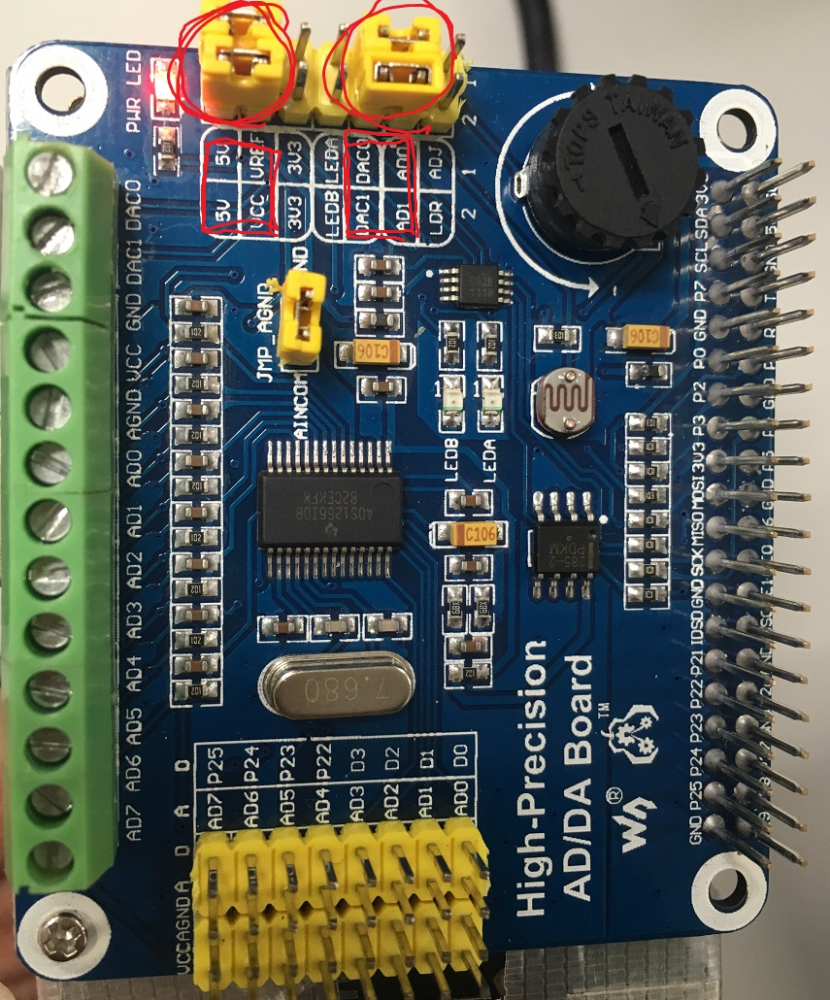

# What's this?

DA output and AD reading using [AD/DA board](https://www.waveshare.com/wiki/High-Precision_AD/DA_Board).


# Usage

First follow [this wiki](https://www.waveshare.com/wiki/High-Precision_AD/DA_Board) to install requirements.

I checked this program with Ubuntu MATE 16.04 on a Raspberry Pi 3.


## Compile

to compile, just run

```
make
```

## Hardware setup

Connect plug as the figure shown below:
- 5V and Vref
- 5V and Vcc
- DA0 and AD0 (for calibration)
- DA1 and AD1 (for calibration)



## calibration

Raspberry Vcc do not exactly fit to 5.0V, so at first you have to revice this error.
For example, Vcc is about `5.053V` in my setup.

This causes drift to DA/AD value, so you need to revice it with `calib` file.

Run `calib` and you'll get the following result.


```
$ sudo ./calib
Supposed DA output[V] DA0:3.000000 DA1:3.000000 
Measured DA output V0 = 3.070409, V1 = 3.066153 
Supposed Vref = 5.058334 
magnitude offset: 1.011667, 1.010965
```

It means both AD/DA values amplified about 1.01 times.
And it says Vref = Vcc should around 5.058, which fits the actual Vcc mesured with a tester.


## DA output

Then you can run the DA output program.

If you want to output 4V from DA0 and 2V from DA1 for 10ms, type follow command.

Remember *output will be held* after execution.


```
$ sudo ./dac8532_output 4 2 10 1.01
```

1.01 means the Vcc amplitude measured in `calib`. Its default value is set to `1.01`.


If you want to set the DA0/DA1 voltage to 0V, type:

```
$ sudo ./dac8532_output 0 0 10
```


# Execution from python

With compiled execution file, you can control DA output from python.

There is a test project named `python_test.py`.
Normally you need sudo to access devices such as /dev/mem.

```
$ sudo python python_test.py
```

This test program using `subprocess` module.

